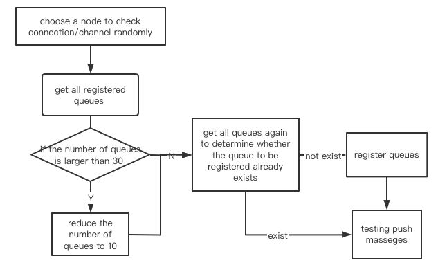

# problem details
## service information
Information file generated by rabbitmq-collect-env script, please refer to information/rabbitmq-env-116ef0c3bf1b-20220712-074728.tgz
## deployment
rabbitmq deployed by docker:
1. image:rabbitmq:management 
2. version:
   1. RabbitMQ 3.10.5 
   2. Erlang 24.3.4.2
## scenario
   
##  usage
One rabbit service connects 4 nodes, each with a channel. There are multiple services to call concurrently. But we make sure that there is no concurrent goroutine using shared channel to push massage.
## problem
1. 504 channel/connection is not open error occurred when pushing massages. Everything works fine at first, but after a while the channel starts to fail and can't be recovered.
2. It happens every time we use one rabbitmq service to connect 4 nodes, but it works well when we only use one node to connect rabbitmq service.
